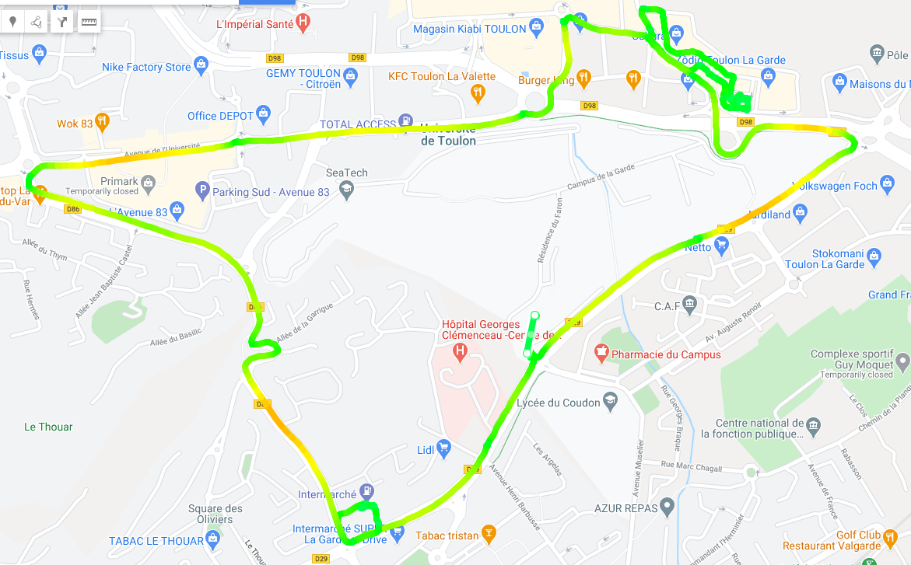

# GPS Python:
### By Florian FloRide Reimat
## About:
This repo is an .nmea to .kml converter, it can work with:
- [x] GGA 
- [x] VTC
- [x] RMC
- [x] ZDA
- [x] GSV 
- [ ] GLL 

This were a classes work in DUT GEII of Toulon (2021)

## How to Use It:
You just need to setup these variable (in \_\_main\_\_.py)
```py
DATA_PATH = "./data/"			# Your Input Folder relative to were you launch the program
DATA_FILE = "balade_gps.txt"		# Your Input Filename
OUTPUT_PATH = "./output/"		# Your Output Folder relative to were you launch the program
OUTPUT_FILE = "kml_output.kml"		# Your Output Filename
```
An then simply launch the program (Warning launch the program according to the relative path you've setup)
```sh
python ./src/__main__.py
```
Once Finish (and if no error occurred) just simply take back your .kml file in the output folder.
### An Error Occurred 
Well just follow the name of the error try to fix it, it's probably that you don't correctly manage to setup your file
And if it's not that, well it's sad, try to debug it or make me an issue

## Examples:
#### Google Earth:


#### Google Map:

